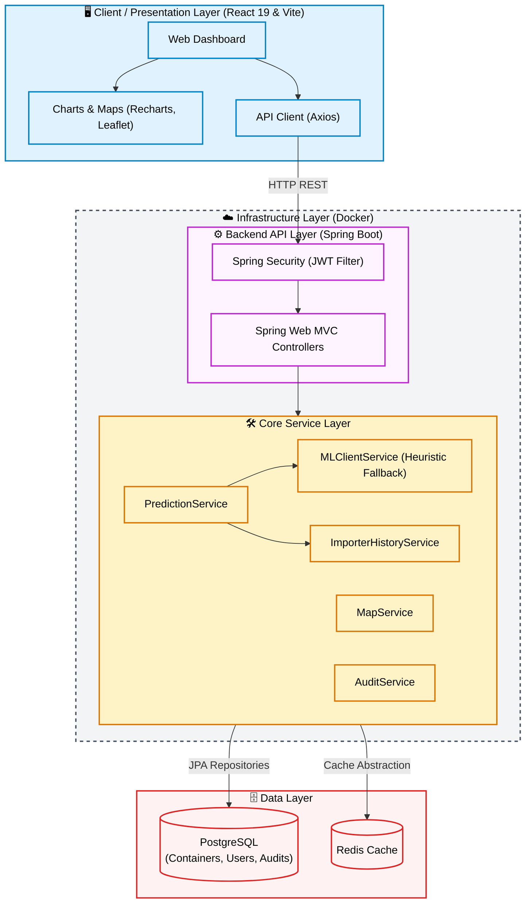

# SmartContainer Risk Engine

A production-ready backend system for analysing container shipment data, predicting risk scores, detecting anomalies, and visualising shipment routes on a map.

---

## Architecture Overview

```
┌─────────────────────────────────────────────────────────┐
│                    Client / Frontend                     │
│           (Dashboard, Map UI, REST Consumer)            │
└────────────────────────┬────────────────────────────────┘
                         │ HTTP
┌────────────────────────▼────────────────────────────────┐
│           Spring Boot Backend (Port 8080)               │
│  ┌──────────┐ ┌──────────┐ ┌──────────┐ ┌──────────┐  │
│  │ Upload   │ │Prediction│ │Dashboard │ │   Map    │  │
│  │Controller│ │Controller│ │Controller│ │Controller│  │
│  └────┬─────┘ └────┬─────┘ └────┬─────┘ └────┬─────┘  │
│       │             │             │             │        │
│  ┌────▼─────────────▼─────────────▼─────────┐  │        │
│  │       Services Layer                      │  │        │
│  │  PredictionService  WorkflowService       │  │        │
│  │  MLClientService           MapService ◄───┘  │        │
│  └───────────────────┬────────────────────────┘         │
│                      │                                   │
│  ┌───────────────────▼──────────────────────────────┐   │
│  │              PostgreSQL (Relational DB)          │   │
│  │              Redis (caching layer)               │   │
│  └──────────────────────────────────────────────────┘   │
└─────────────────────────────────────────────────────────┘
```

---

## Project Structure

```
smartcontainer-risk-engine/
├── docker-compose.yml
├── README.md
├── frontend/                  # React & Vite frontend
└── backend-spring/            # Spring Boot Backend
    ├── pom.xml
    ├── Dockerfile
    ├── src/
    │   ├── main/
    │   │   ├── java/com/smartcontainer/
    │   │   │   ├── SmartContainerApplication.java
    │   │   │   ├── config/          # Security, Redis, Async configs
    │   │   │   ├── controller/      # REST API Controllers
    │   │   │   ├── dto/             # Data Transfer Objects
    │   │   │   ├── entity/          # JPA Entities
    │   │   │   ├── exception/       # Global Exception Handlers
    │   │   │   ├── repository/      # Spring Data JPA Repositories
    │   │   │   ├── security/        # JWT Authentication
    │   │   │   └── service/         # Business Logic & Heuristics
    │   │   └── resources/
    │   │       └── application.properties
    └── data/
        └── uploads/                 # Uploaded datasets
```

---

## Quick Start — Local Development (without Docker)

### Prerequisites
- Java 21 (JDK)
- PostgreSQL >= 15 running locally on port 5432
- (Optional) Redis on port 6379

### 1. Configure Database
Ensure PostgreSQL is running and you have a database created. Update `backend-spring/src/main/resources/application.properties` if your credentials differ from the defaults:
```properties
spring.datasource.url=jdbc:postgresql://localhost:5432/smartcontainer_db
spring.datasource.username=postgres
spring.datasource.password=postgres
```

### 2. Start the Spring Boot backend
```bash
cd backend-spring
mvn clean spring-boot:run
```
The API is now available at `http://localhost:8080`.

### 3. Start the Frontend
```bash
cd frontend
npm install
npm run dev
```

---

## Quick Start — Docker Compose (Recommended)

```bash
cd smartcontainer-risk-engine

# Build and start all services
docker-compose up --build

# Or in detached mode
docker-compose up --build -d

# View logs
docker-compose logs -f backend

# Stop all services
docker-compose down
```

Services started:
| Service | Port |
|---------|------|
| Spring Boot Backend | 8080 |
| PostgreSQL | 5432 |
| Redis | 6379 |

---

## API Reference

### Health Check
```
GET /health
```

---

### 1. Upload Dataset
```
POST /api/upload
Content-Type: multipart/form-data
Field: file (CSV file)
```

**Response:**
```json
{
  "success": true,
  "data": {
    "job_id": "uuid-here",
    "status": "PROCESSING"
  }
}
```

---

### 2. Predict Single Container Risk
```
POST /api/predict
Content-Type: application/json
```

**Request Body:**
```json
{
  "container_id": "C12345",
  "origin_country": "China",
  "destination_country": "United Kingdom",
  "destination_port": "London",
  "trade_regime": "Import",
  "importer_id": "IMP001",
  "exporter_id": "EXP099",
  "declared_value": 85000,
  "declared_weight": 12000,
  "measured_weight": 18500,
  "dwell_time_hours": 120,
  "hs_code": "8471",
  "shipping_line": "Maersk"
}
```

**Response:**
```json
{
  "success": true,
  "data": {
    "risk_score": 0.8234,
    "risk_level": "Critical",
    "anomaly_flag": true,
    "anomaly_score": 0.73
  }
}
```

---

### 3. Dashboard Summary
```
GET /api/summary
```

**Response:**
```json
{
  "success": true,
  "total_containers": 15000,
  "critical_count": 1200,
  "low_risk_count": 4500,
  "clear_count": 9300,
  "anomaly_count": 950
}
```

---

## Risk Classification Logic

| Risk Score | Risk Level |
|------------|-----------|
| ≥ 0.70     | **Critical** |
| 0.40–0.69  | **Low Risk** |
| < 0.40     | **Clear** |

---

## Fallback Behaviour

The system is designed to degrade gracefully:
- **Redis unavailable** → Caching disabled, all requests hit PostgreSQL directly.
- **ML microservice unavailable** → Spring Boot applies a heuristic scoring algorithm based on engineered features (e.g. weight mismatches, dwell times).

---

## Security

- All API endpoints are secured via stateless JWT Authentication.
- Passwords are encrypted using BCrypt.
- File uploads are validated (only CSV allowed).
- Cross-Origin Resource Sharing (CORS) is configured explicitly.
- Spring Data JPA is used to prevent SQL Injection attacks.

---


